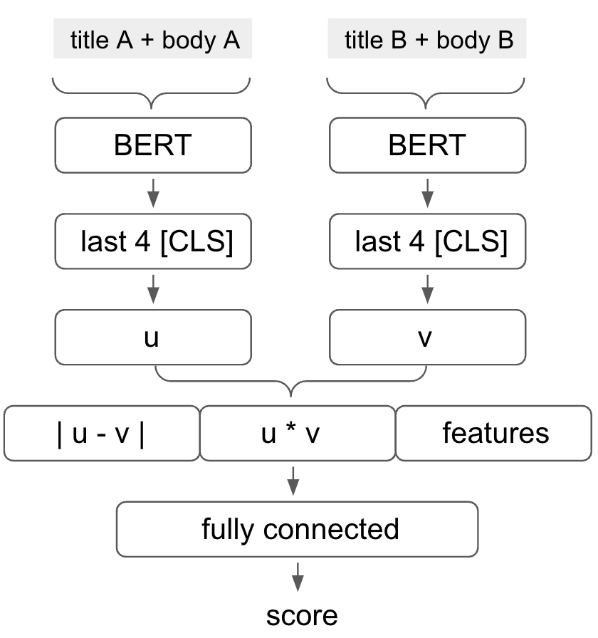

# Exploring BERT-based Bi-Encoder Approach for Pairwise Multilingual News Article Similarity

12th place solution for SemEval 2022 Task 8: Multilingual News Article Similarity.
The final prediction is calculated by a weighted average of the output of the four neural networks.


The following figure illustrates the base architecture of each neural network.


## Dataset preparation

1. Download csv files from [CodaLab](https://competitions.codalab.org/competitions/33835).
1. Fetch meta data of news articles by official provided [downloader](https://github.com/euagendas/semeval_8_2022_ia_downloader).
1. Run `src/prepare_dataset.py`.
1. Run `src/translate_dataset.py`.
1. Run `src/extract_features.py` to create some hand-craft features like Jaccard Index, Dice Index, and cosine similarity.

## Training

Run `src/run_model_XXX.sh`.
When you do `sh run_model_001.sh`, the following command is executed.

```bash
python train_nn.py \
    --fold 0 \
    --max_len 512 \
    --num_folds 5 \
    --model bert-base-multilingual-cased \
    --custom_header concat \
    --lr 1e-5
```

## Submission

Run `src/submit.py`.

```bash
python submit.py
```

## Citation

```
@inproceedings{nikkei2022-semeval,
year={2022},
author={Shotaro Ishihara and Hono Shirai},
title={Nikkei at {SemEval-2022 Task 8}: Exploring BERT-based Bi-Encoder Approach for Pairwise Multilingual News Article Similarity},
booktitle={Proceedings of the 16th International Workshop on Semantic Evaluation (SemEval-2022)},
publisher={Association for Computational Linguistics}
}
```
